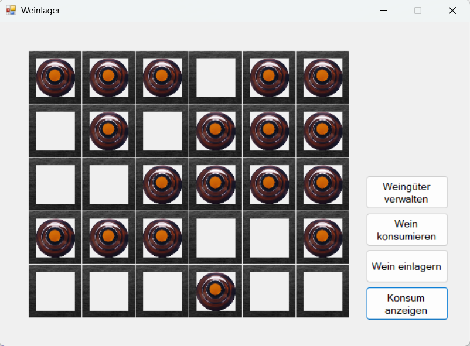
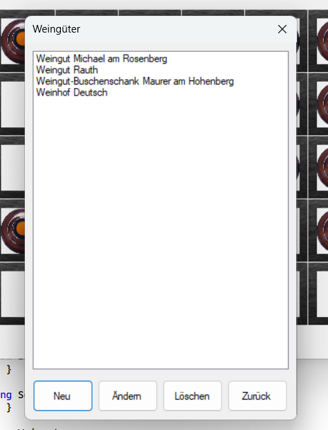
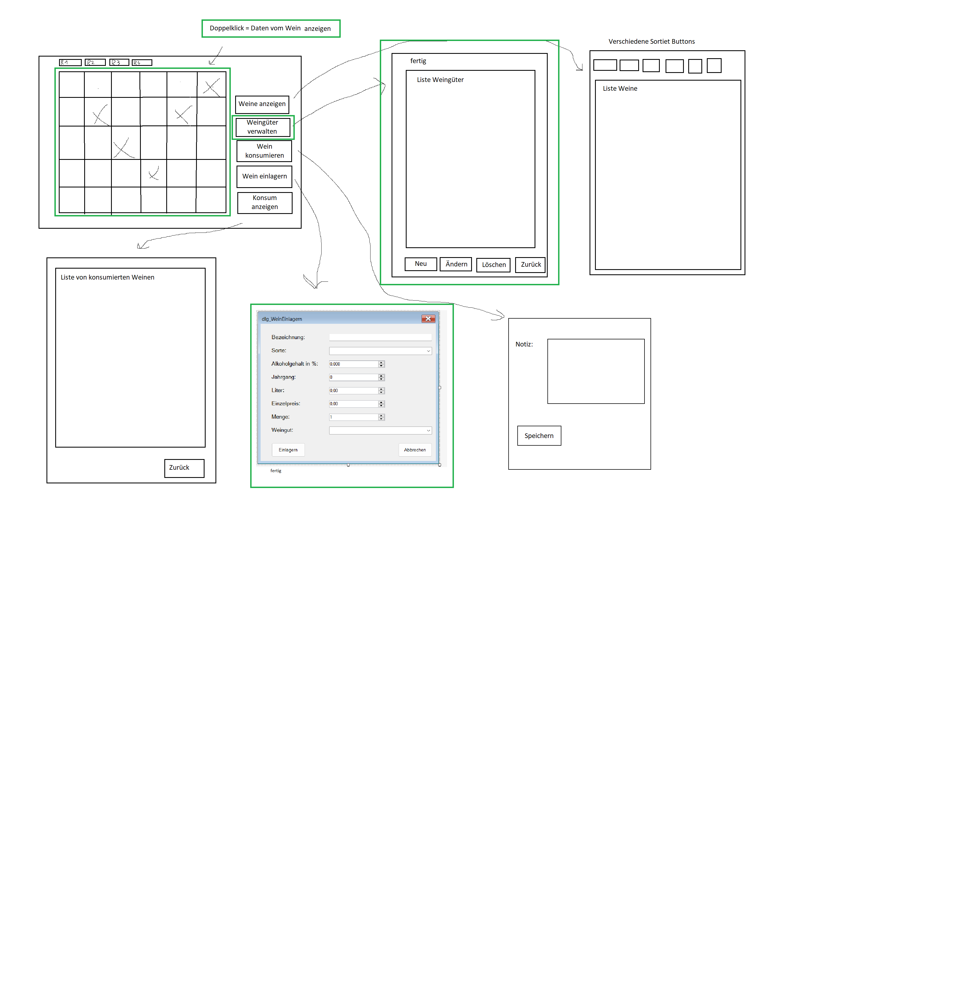

# Weinverwaltung

Eine Desktop-Anwendung (C# / WinForms) zur digitalen Verwaltung eines Weinlagers – von der Erfassung der Weingüter über die Einlagerung bis zum Konsum einzelner Flaschen inklusive persönlicher Notizen.

## Funktionen

* **Lagerübersicht:** Grafische Darstellung des Weinregals; jede Flasche ist ein anklickbares Feld
* **Weingüter verwalten:** Anlegen, Ändern und Löschen von Weingütern über einen eigenen Dialog
* **Wein einlagern:** Neuen Wein anlegen oder Bestand eines bereits vorhandenen Weins erhöhen
* **Wein konsumieren:** Ausgewählte Flasche aus dem Lager entnehmen und optional eine persönliche Verkostungsnotiz hinterlegen
* **Details ansehen:** Doppelklick auf eine Flasche zeigt die vollständigen Informationen zum jeweiligen Wein
* **Konsumhistorie:** Übersicht aller bisher konsumierten Weine samt Notizen

## Screenshots

**Hauptansicht – Weinlager:**

**Verwaltung der Weingüter:**

## Technologien

* C# (.NET, Windows Forms)
* MySQL (lokal über XAMPP)
* Objektorientierte Architektur mit mehreren Fachklassen (z. B. für Wein, Weingut, Lagerbestand)
* Delegates zur Kommunikation zwischen Hauptfenster und Dialogfenstern (z. B. beim Öffnen der Weingüter-Verwaltung oder beim Einlagern/Konsumieren)

## Datenbank-Setup

Die Anwendung benötigt eine lokale MySQL-Datenbank (getestet mit XAMPP):

1. [XAMPP](https://www.apachefriends.org/) installieren und den Apache- sowie MySQL-Dienst starten
2. phpMyAdmin öffnen (`http://localhost/phpmyadmin`)
3. Neue Datenbank importieren: `db_weinverwaltung.sql` (im Repo enthalten) über "Importieren" einspielen
4. Die Datenbank enthält folgende Tabellen:

   * `tbl_artikel` – die einzelnen Weine (Bezeichnung, Alkoholgehalt, Jahrgang, Menge, Preis, …)
   * `tbl_weingut` – die Weingüter (Name, Adresse, Kontaktdaten)
   * `tbl_sorte` – Rebsorten (z. B. Riesling, Cabernet Sauvignon, …)
   * `tbl_regal` – Definition des Weinregals (Anzahl Fächer/Spalten)
   * `tbl_regalplatz` – Zuordnung, welcher Wein an welchem Regalplatz liegt

5. Verbindungsdaten in der Anwendung ggf. an die eigene lokale MySQL-Konfiguration anpassen (Standard: `localhost`, Benutzer `root`, kein Passwort)

## Architektur (Kurzüberblick)

Die Anwendung ist in mehrere Klassen aufgeteilt, die jeweils einen klar abgegrenzten Verantwortungsbereich abdecken (z. B. Datenmodell für Weine, Verwaltung der Weingüter, Steuerung des Lagerbestands). Die Kommunikation zwischen dem Hauptfenster und den einzelnen Dialogen (Weingüter verwalten, Wein einlagern, Wein konsumieren) erfolgt über Delegates, wodurch die einzelnen Formulare voneinander entkoppelt bleiben.

## Was ich dabei gelernt habe

* Strukturierung einer größeren WinForms-Anwendung in mehrere zusammenarbeitende Klassen
* Einsatz von Delegates zur Entkopplung von Hauptfenster und Dialogfenstern
* Verwaltung zusammenhängender Datenmodelle (Weingut ↔ Wein ↔ Lagerbestand ↔ Konsumhistorie)
* Umsetzung einer intuitiven, klickbaren Benutzeroberfläche für die Lagerverwaltung

## Planung

Vor der Umsetzung wurde ein grober UI-Plan mit allen Ansichten und Abläufen (Hauptfenster, Weingüter-Verwaltung, Einlagern-Dialog, Konsum-Notiz, …) skizziert:

## Ausführen

1. Datenbank wie oben beschrieben in XAMPP einrichten
2. Projekt in Visual Studio öffnen (XAMPP muss mit der Datenbank gestartet sein um zu funktionieren)
3. Build starten (F5) – Zielplattform: Windows (.NET)
